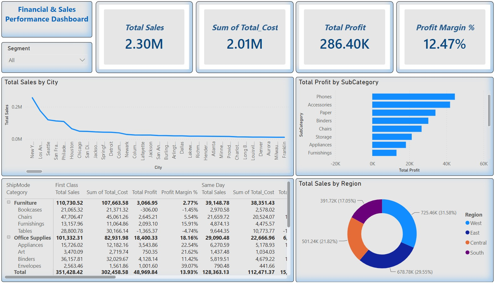

# 📊 Superstore Financial & Sales Analysis (SQL Server + Power BI)

## 📌 Executive Summary
An end-to-end Data Analytics & Business Intelligence project focusing on evaluating financial performance, product margins, and sales channels for a retail store dataset. The objective is to identify loss-making categories, optimize profitability, and visualize key performance metrics via interactive Power BI dashboards.

---

## 🛠️ Tech Stack & Tools
* **Database:** SQL Server (Data Import, Cleaning, Financial Calculations & Views Creation)
* **BI Tool:** Power BI Desktop (Data Modeling, DAX Measures, Interactive Dashboards)
* **Dataset:** Kaggle Sample Superstore Dataset

---

## 📷 Dashboard Preview

---

## 🔍 Key Insights & Business Recommendations
1. **Revenue vs. Profitability:** The store generated **$2.30M in Total Sales** with a net profit of **$286.40K**, yielding an overall **Profit Margin of 12.47%**.
2. **Loss-Making Sub-Categories:** 
   * Products like **Tables** (-$1,365.37) and **Bookcases** (-$306.00) suffer from negative margins due to excessive discounting strategies.
3. **Regional Performance:** 
   * **West Region** leads the revenue with **31.58%**, followed by the **East Region (29.55%)**.
4. **Actionable Recommendations:**
   * Re-evaluate discount rates on furniture categories (*Tables & Bookcases*).
   * Focus marketing efforts on high-margin sub-categories like *Copiers* and *Phones*.

---

## 📁 Repository Structure
* `SQLQuery1.sql`: Contains SQL scripts for table creation, data cleaning, financial metrics, and views.
* `Superstore-Financial-Analysis.pbix`: Interactive Power BI Report file.
* `SampleSuperstore.csv`: Raw dataset.
* `Dashboard_Preview.jpeg`: Snapshot of the main report.
